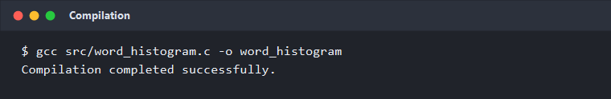
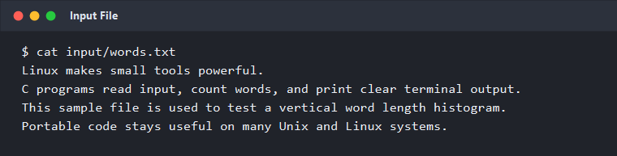
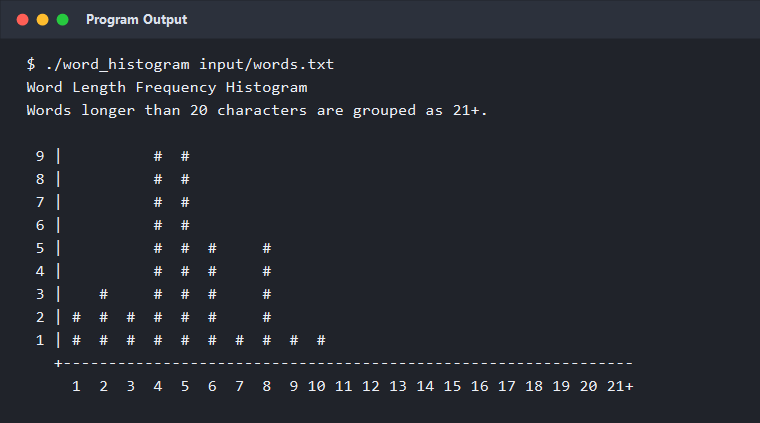

# Word Count and Vertical Histogram Generation Using File Handling in C on Linux

A group project developed using **C programming and Linux** to read words from a text file, analyze their lengths, calculate their frequency, and generate a vertical histogram in the Linux terminal.

This project demonstrates fundamental C programming concepts along with file handling, character processing, arrays, functions, GCC compilation, and Linux command-line execution.

---

## Project Overview

The program reads an input text file and analyzes the words based on their length.

The program:

- Reads the input file character by character
- Identifies individual words
- Calculates the length of each word
- Counts the frequency of each word length
- Generates a vertical frequency histogram
- Groups words longer than 20 characters into the `21+` category
- Accepts an input file through command-line arguments
- Compiles and executes using GCC on Linux

---

## Technologies Used

- **Programming Language:** C
- **Operating System:** Linux / Ubuntu
- **Compiler:** GCC
- **Interface:** Linux Terminal

### Concepts Used

- C Programming Fundamentals
- Variables and Data Types
- Arrays
- Functions
- Loops
- Conditional Statements
- File Handling
- Character Processing
- Frequency Counting
- Command-Line Arguments
- GCC Compilation
- Linux Terminal

---

## How It Works

The program follows these basic steps:

```text
              Input Text File
                     |
                     v
          Read File Character by Character
                     |
                     v
              Identify Words
                     |
                     v
           Calculate Word Length
                     |
                     v
             Count Frequencies
                     |
                     v
          Generate Vertical Histogram
                     |
                     v
              Terminal Output
```

---

## Project Structure

```text
Word-Count-Vertical-Histogram-C-Linux/
│
├── src/
│   └── word_histogram.c
│
├── input/
│   └── words.txt
│
├── screenshots/
│   ├── 01_compilation.png
│   ├── 02_input_file.png
│   └── 03_program_output.png
│
├── docs/
│   └── Linux_Report.pdf
│
├── README.md
└── .gitignore
```

---

## Compilation

Open the Linux terminal in the project root directory and compile the program using GCC:

```bash
gcc src/word_histogram.c -o word_histogram
```

---

## Execution

Run the program using the provided input file:

```bash
./word_histogram input/words.txt
```

A different text file can also be provided:

```bash
./word_histogram path/to/your/file.txt
```

---

## Example Output

The program generates a vertical histogram based on the frequency of different word lengths.

```text
Word Length Frequency Histogram
Words longer than 20 characters are grouped as 21+.

 9 |          #  #
 8 |          #  #
 7 |          #  #
 6 |          #  #
 5 |          #  #  #     #
 4 |          #  #  #     #
 3 |    #     #  #  #     #
 2 | #  #  #  #  #  #     #
 1 | #  #  #  #  #  #  #  #  #  #
   +---------------------------------------------------------------
     1  2  3  4  5  6  7  8  9 10 11 12 13 14 15 16 17 18 19 20 21+
```

> The exact histogram output depends on the contents of the input file.

---

# Screenshots

## 1. Compilation

The program is compiled using GCC in the Linux terminal.



---

## 2. Input File

The sample input file used for testing the program.



---

## 3. Program Output

The generated vertical word-length frequency histogram.



---

# Academic Information

**Program:** B.E. Electronics and Communication Engineering  
**Semester:** 6th Semester  
**Institution:** KLS Gogte Institute of Technology, Belagavi, Karnataka

## Project Guide

**Prof. Anusha Hodlur**

---

# Team Members

This project was developed collaboratively as a **group project** by:

| Name | Role |
|------|------|
| Abhay S Nagure | Team Member |
| Abhishek P Karadi | Team Member |
| Vinyas V Kulkarni | Team Member |

---

# Contributions

The project was completed collaboratively by all team members.

The team worked on the implementation, testing, documentation, and preparation of the project report.

This repository contains the source code, input file, screenshots, and academic project report associated with the project.

---

# Project Report

The complete academic project report is available in the repository:

[View Project Report](docs/Linux_Report.pdf)

---

# Learning Outcomes

Through this project, the team gained practical experience in:

- Developing C programs in a Linux environment
- Working with files using C
- Reading files character by character
- Processing and analyzing words
- Using arrays for frequency counting
- Organizing programs using functions
- Using command-line arguments
- Compiling C programs using GCC
- Executing programs through the Linux terminal
- Applying C programming concepts to a practical problem

---

# Contributors

- **Abhay S Nagure**
- **Abhishek P Karadi**
- **Vinyas V Kulkarni**

---

## License

This project is intended for academic and educational purposes.
